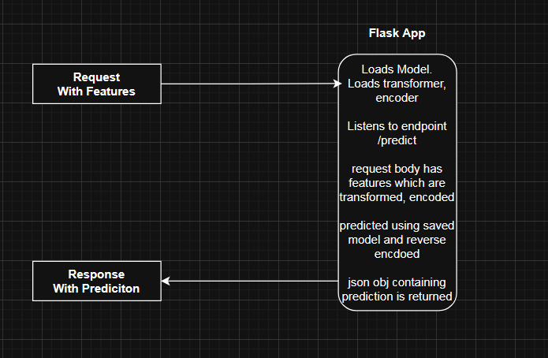

<<<<<<< HEAD

=======
OPEN README FOR CLARITY

Structure:

| requests containing features | ---> | Flask App                          |
                                      | loads model                        |
                                      | loads transformer and encoder      |
                                      | listens to end point at /predict   |
                                      |                                    |
                                      | request body has features          |
                                      | features are transformed, encoded  |
                                      | predicted using saved model        |
                                      | predictions reverse encoded        |
                                      |                                    |
                                      | make a json object containing pred |  
                                      |                                    |  
|response containing prediction| <--- | return json obj as response        |
>>>>>>> 358dd0c7cb273cce50bcb96fe611bf0fc4666a06
